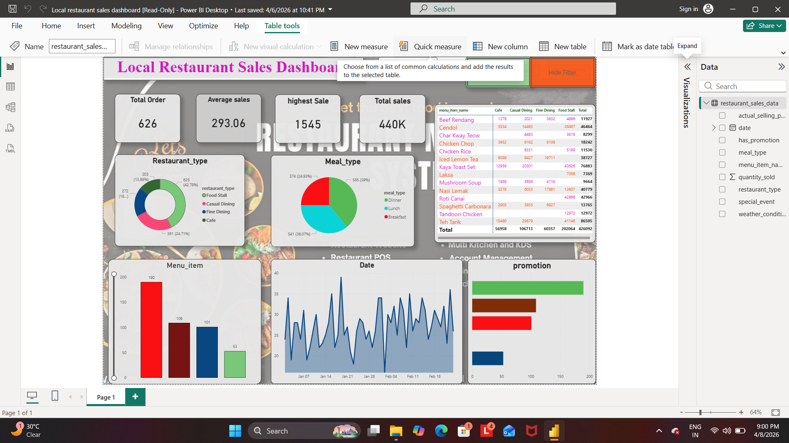

# Local Restaurant Sales Dashboard

## 📊 Project Overview
This project is a Power BI dashboard that analyzes restaurant sales data and provides meaningful insights for decision-making.

## 🔍 Key Insights
- Total Orders: 626
- Total Sales: 440K
- Average Sales: 293.06
- Highest Sale: 1545

## 📌 Features
- Sales trend analysis
- Meal type distribution (Breakfast, Lunch, Dinner)
- Restaurant type comparison
- Promotion impact analysis
- Interactive filters

## 🛠 Tools Used
- Power BI
- Data Visualization
- Data Analytics

## 📷 Dashboard Preview

## 🔗 Project Link
https://github.com/lavatedipali05-arch/Local-Restaurant-Sales-Dashboard

## 💡 Conclusion
This dashboard helps understand customer behavior, sales patterns, and business performance effectively.

---

✨ Feel free to connect and share feedback!# Local-Restaurant-Sales-Dashboard
power BI dashboard analyzing restaurant sales data with key insights and visualization
